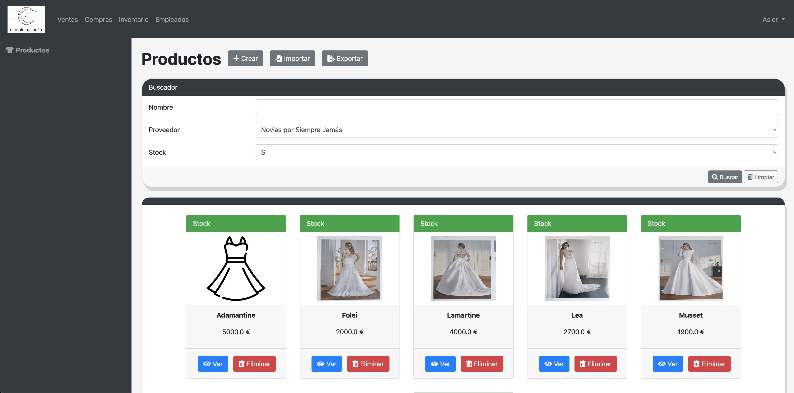
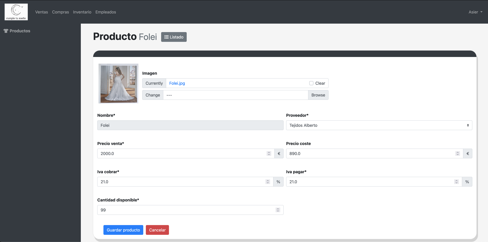
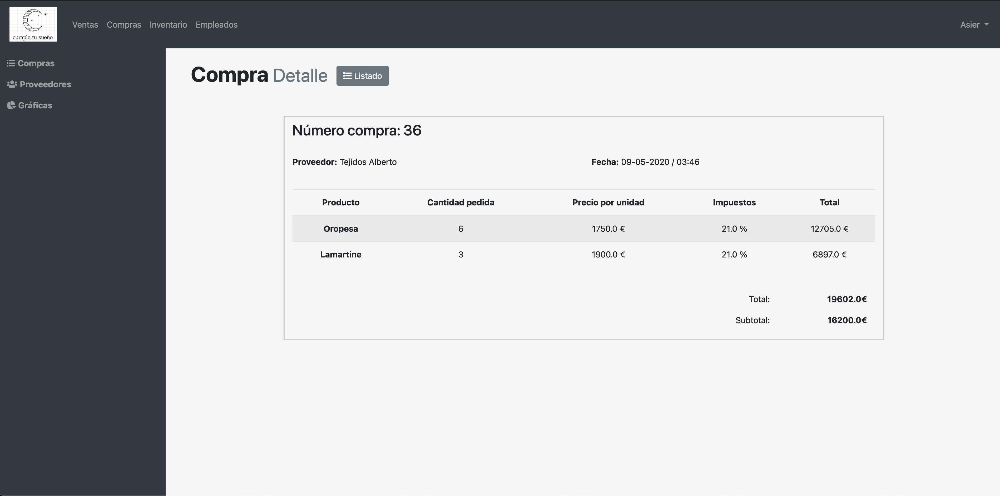
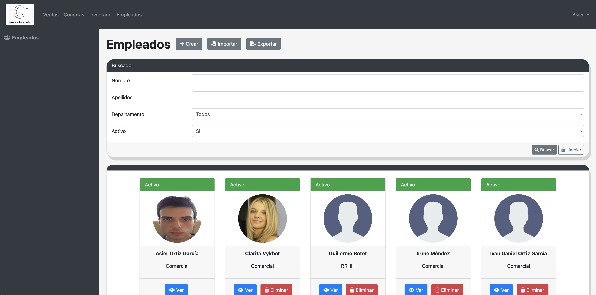
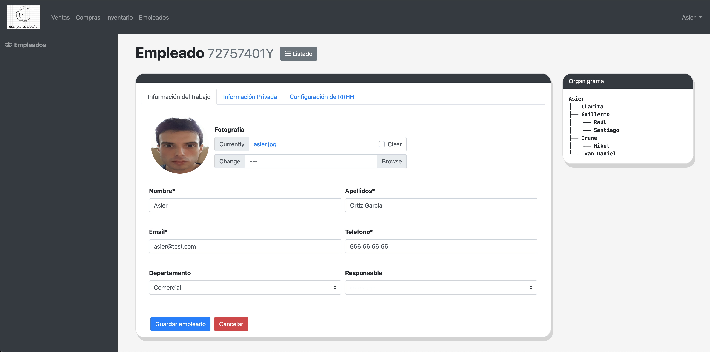
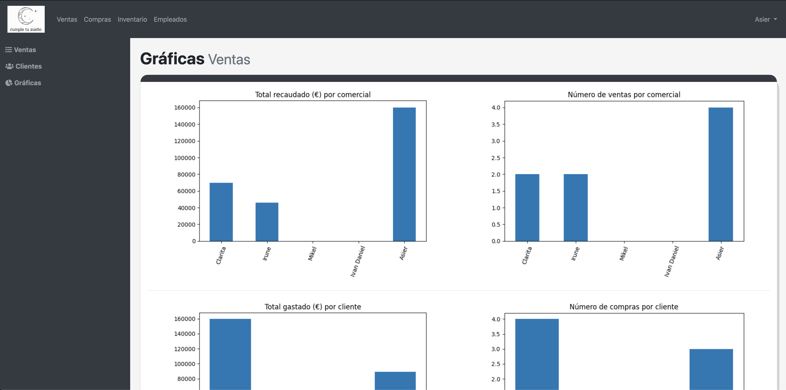

# Cumple tu sueño

"Cumple tu sueño" is a project to learn the basics of Django framework that allows the management of employees, suppliers, products, keep the track of sales, visualize data in graphs and import and export files in CSV format. It stores all the data an embedded SQLite database

## How to build
- Create a new venv directory in project's root folder `python3 -m venv venv`
- Activate the virtual environment `source venv/bin/activate`
- Install dependencies `pip install -r requirements.txt`
- Run the project `python manage.py runserver 8080`
- Navigate to <http://localhost:8080>
- Login credentials: username: `Asier` password: `12345Abcde`

## Screenshots

 

 

 
